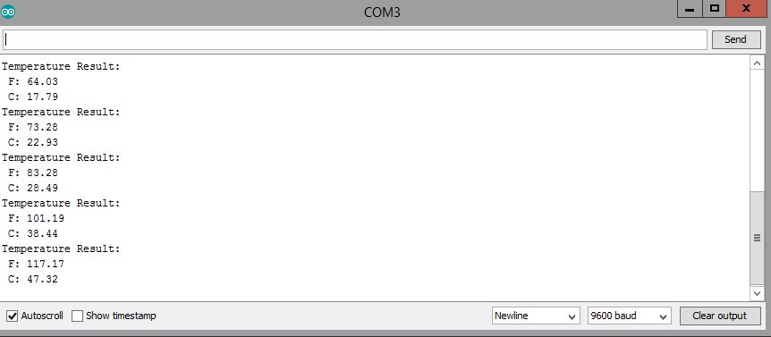

# Temperature Calculating

<p align="center">
  <em>Arduino-based temperature calculation using the Steinhart-Hart equation.</em>
</p>

<p align="center">
  
  
  
  
</p>

<p align="center">
  <a href="https://github.com/noorcs39/Temperature-Calculating/stargazers">
    
  </a>
  <a href="https://github.com/noorcs39/Temperature-Calculating/network/members">
    
  </a>
</p>

## Overview

**Temperature Calculating** is a bachelor project that calculates temperature from a thermistor sensor connected to an Arduino board. The project reads analog sensor values, converts the thermistor resistance, and calculates the temperature in Celsius and Fahrenheit using the Steinhart-Hart equation.

This project is useful for learning basic embedded systems, Arduino programming, analog sensor reading, and temperature conversion formulas.

## Features

- Reads thermistor data from an Arduino analog pin.
- Calculates resistance from the sensor voltage divider.
- Uses the Steinhart-Hart equation for temperature estimation.
- Prints temperature values in both Celsius and Fahrenheit.
- Displays live results in the Arduino Serial Monitor.

## Hardware Requirements

- Arduino Nano or compatible Arduino board
- Thermistor temperature sensor
- 10k ohm resistor
- Breadboard
- Jumper wires
- USB cable for programming and serial monitoring

## Software Requirements

- Arduino IDE
- USB driver for your Arduino board, if required

## Circuit

The thermistor is connected as part of a voltage divider circuit. The Arduino reads the analog value from pin `A0` and uses that value to estimate the thermistor resistance.


## How to Run

1. Open `src/TemperatureCal/TemperatureCal.ino` in the Arduino IDE.
2. Connect the thermistor circuit to analog pin `A0`.
3. Select the correct board and port from the Arduino IDE.
4. Upload the sketch to the Arduino board.
5. Open the Serial Monitor.
6. Set the baud rate to `9600`.

## Example Output

The Serial Monitor prints the calculated temperature values:

```text
Temperature Result:
F: 73.28
C: 22.93
```



## Project Structure

```text
Temperature-Calculating/
├── src/
│   └── TemperatureCal/
│       └── TemperatureCal.ino
├── output/
│   ├── circuit.jpg
│   └── result.jpg
├── LICENSE
└── README.md
```

## Testing

This is an Arduino hardware project, so it does not use `pytest`. The project can be tested by uploading the sketch to an Arduino board and checking the Serial Monitor output at `9600` baud.

Recommended checks:

- Confirm the thermistor is connected to analog pin `A0`.
- Confirm the fixed resistor value is `10k ohm`.
- Warm the thermistor gently and verify that the temperature reading increases.
- Let the thermistor cool and verify that the temperature reading decreases.

## Repository Topics

Suggested GitHub topics:

`arduino` `temperature-sensor` `thermistor` `embedded-systems` `c-plus-plus` `arduino-nano` `serial-monitor` `bachelor-project`

## Contact

Noor Uddin — [noor.cs2@yahoo.com](mailto:noor.cs2@yahoo.com)

<p>
  <a href="https://github.com/noorcs39">
    
  </a>
  <a href="mailto:noor.cs2@yahoo.com">
    
  </a>
</p>

## License

This project is licensed under the MIT License. See the [LICENSE](LICENSE) file for details.
